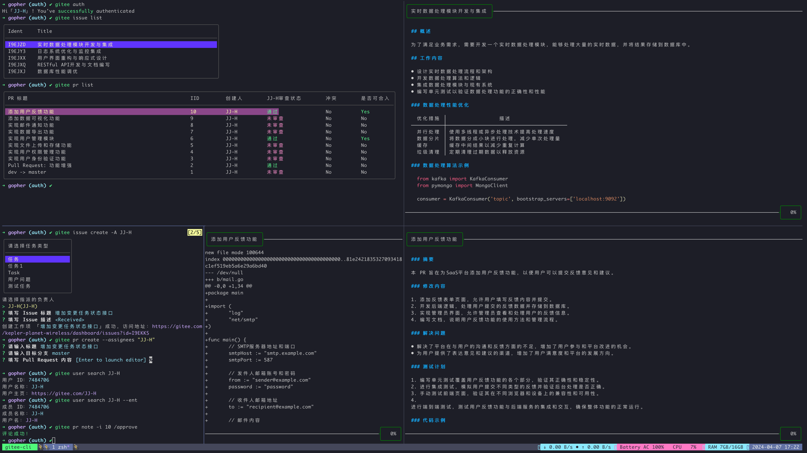

## Gitee CLI
> 诞生背景：对于开发者来说，日常的开发往往离不开 terminal，以往的流程一般是：编写代码 -> 提交代码 -> 创建 Pull Request -> 测试 -> Bug Fix -> 重新测试 -> 测试通过 -> Code Review -> 合入主线，
> 创建 Pull Request 等一系列动作往往只能在 web 端进行操作，往往需要切换上下文，Gitee CLI 因而诞生，旨在减少上下文的切换.
## 部分功能示例


## Usage

### 构建方式

#### Homebrew 安装
> 目前暂时还未向官方仓库提交 formula 文件，需手动添加 tab
```shell
brew tap JJ-H/tap

brew install gitee
```

#### 手动安装
```shell
git clone https://github.com/JJ-H/gitee_cli.git

cd gitee_cli

mkdir $HOME/.gitee

cp config/config.yml.example $HOME/.gitee/config.yml

go build -o bin/gitee main.go

sudo cp ./bin/gitee /usr/local/bin/gitee
```

### 配置说明
```shell
# 个人私人令牌，用于 V5 鉴权
access_token: xxxxxxxx
api_prefix: https://gitee.com/api/v5
# 用户在 Gitee 上的 ID
user_id: xxxxx
# 用户名
user_name: xxx
# 非仓库目录下执行 gitee cli 命令默认仓库全路径（配置你比较常用的仓库）
default_path_with_namespace: test/test
# cookie 用于企业版 API 鉴权（由于加密登录的问题，此处暂时需要手动复制 cookie[可使用 gitee config cookie xxxxxx]）
cookies_jar: xxxxxxx
```
#### 可通过 gitee config [key] [value] 的方式设置
```shell
gitee config access_token xxxxxx

# 用户 ID 可使用如下命令查询(请精准输入你的username)
➜ ~ gitee user search JJ-H
用户 ID：7484706
用户名称：JJ-H
用户主页：https://gitee.com/JJ-H
```

### Tab 自动补全！！！（强烈建议不要跳过这一步）
> 得益于框架的优秀设计，Gitee CLI 支持快速生成 Tab 自动补全脚本，目前支持 bash、fish、powershell、zsh

```shell
➜ ~ gitee completion --help
Generate the autocompletion script for gitee for the specified shell.
See each sub-command's help for details on how to use the generated script.

Usage:
  gitee completion [command]

Available Commands:
  bash        Generate the autocompletion script for bash
  fish        Generate the autocompletion script for fish
  powershell  Generate the autocompletion script for powershell
  zsh         Generate the autocompletion script for zsh

Flags:
  -h, --help   help for completion

Use "gitee completion [command] --help" for more information about a command.
```
#### 下面以 zsh 为例
```shell
# Linux 用户
gitee completion zsh > "${fpath[1]}/_gitee"
# 执行完毕后在 ~/.zshrc 中增加如下语句：
source ${fpath[1]}/_gitee

# macOS 用户
gitee completion zsh > $(brew --prefix)/share/zsh/site-functions/_gitee
# 执行完毕后在 ~/.zshrc 中增加如下语句：
source $(brew --prefix)/share/zsh/site-functions/_gitee
```
重启终端，输入 gitee 按下 tab，您将得到如下自动补全提示（子命令同样支持）
```shell
➜ ~ gitee [press tab]
auth        -- Authenticate Gitee CLI with gitee selector
build       -- Build a k8s pod by note a specified pull request
completion  -- Generate the autocompletion script for the specified shell
config      -- Manage Gitee CLI config, Usage: config key [value]
selector  -- Manage enterprises
help        -- Help about any command
lightPr     -- Create a lightPr
pr          -- Manage pull requests
ssh-key     -- Manage ssh-keys
user        -- User related command
```


### 使用方式
```shell
➜ ~ gitee --help
Gitee CLI is a tool which interact with gitee server seamlessly via terminal

Usage:
  gitee [command]

Available Commands:
  auth              Authenticate Gitee CLI with gitee selector_tui
  completion        Generate the autocompletion script for the specified shell
  config            Manage Gitee CLI config, Usage: config key [value]
  enterprise        Manage enterprises
  help              Help about any command
  issue             Manage issues
  pr                Manage pull requests
  ssh-key           Manage ssh-keys
  user              User related command

Flags:
  -h, --help      help for gitee
  -v, --version   version for gitee

Use "gitee [command] --help" for more information about a command.
```

### Auth 相关
```shell
➜ ~ gitee auth --help
Authenticate Gitee CLI with gitee selector

Usage:
  gitee auth [flags]

Flags:
  -f, --cookies-file string   path to a file containing cookies
  -h, --help                  help for auth

```

### Config 相关
```shell
➜ ~ gitee config --help
Manage Gitee CLI config, Usage: config key [value]

Usage:
  gitee config [flags]

Flags:
  -h, --help   help for config
```

### Pull Request 相关
- 列出当前所在仓库下我审查的 Pull Request `gitee pr list [flags]`
    > 说明：列表模式下，按 c 将拷贝 pull request iid 至粘贴板，按 v 预览详情，按 d 预览 diff，回车使用浏览器打开

    
- 根据 commit 找到对应的被合入至当前分支的 Pull Request `gitee pr list -c <commit>`
    ```shell
    ➜ ~ gitee pr list -c "80b4ef95c0d"
    请在仓库目录下执行该命令！
    ➜ ~ cd /home/git/gitee
    ➜ gitee (master) ✔ gitee pr list -c "80b4ef95c0d"
    该 commit 由 PR: 「修改仓库模糊查询，支持namespace级联查询，修复全英文字符查询时只匹配path问题」 合入，访问地址: https://gitee.com/hightest/settings/pulls19977
    ```
- 创建 pull_request
    ```shell
      ➜ ~ gitee pr create
      请输入标题：feature -> master
      请输入目标分支：master
      ? 填写 Pull Request 内容 <Received>
      创建 PR「feature -> master」 成功，访问地址：https://gitee.com/hightest/settings/pulls/3
    ```
- 评论 Pull request，一般用于触发 webhook
    ```shell
    ➜ gitee (master) ✔ gitee pr note -i 19995 /approve
    评论成功！
    ```
- 评审通过 Pull Request
    ```shell
    ➜ gitee (master) ✔ gitee pr review 19995
    审查通过🏅
    ```
- 关闭 Pull Request
    ```shell
    ➜ gitee (master) ✔ gitee pr close 19995
    关闭 PR 成功🏅
    ```
  
### Issue 相关
- 创建 issue
```shell
➜ ~ gitee issue create --feature
请选择要创建的任务类型
> 需求

Press q to quit.
请输入标题 这是需求标题
? 填写 Issue 描述 <Received>
创建工作项 「需这是需求标题」成功，访问地址：https://gitee.com/kepler-planet-wireless/dashboard/issues?id=I9A7ZY
```

- issue 列表
    > 说明：列表模式下，按 c 将拷贝 issue ident 至粘贴板，按 v 预览详情，按 s 变更状态，回车使用浏览器打开

    

### SSH Key 相关
```shell
➜ ~ gitee ssh-key --help
Manage ssh-keys

Usage:
  gitee ssh-key [command]

Available Commands:
  add         Add a ssh pub key for personal
  delete      delete a specified ssh key
  list        List personal ssh pub keys

Flags:
  -h, --help   help for ssh-key

Use "gitee ssh-key [command] --help" for more information about a command.
```
- 获取当前账户所有已上传的公钥 `gitee ssh-key list`
```shell
➜ gitee (master) ✔ gitee ssh-key list
+--------------+----------------------------------------------------+--------------------------------+
|  SSH KEY ID  |                      KEY SHA                       |          PREVIEW URL           |
+--------------+----------------------------------------------------+--------------------------------+
| 3123223      | ssh-rsa AAAAB3NzaC1yc2EAAAADAAXCSAABAQC6r/S6pJsv8x | https://gitee.com/keys/3123223 |
| 3233333      | ssh-rsa AAAAB3NzaC1yc2EAAAADAQ786AABgQCgiABu1TWbSI | https://gitee.com/keys/3233333 |
| 3242234      | ssh-ed25519 AAAAC3NzaC1lZDI1N765SAAAIISV/On6vy1UNg | https://gitee.com/keys/3242234 |
| 2322332      | ssh-rsa AAAAB3NzaC1yc2EAAAADAADSDAABAQCpKcep+/DlEb | https://gitee.com/keys/2322332 |
| 1233562      | ssh-ed25519 AAAAC3NzaC1lZDIASDSASAAAIA9aZBvftMp1dT | https://gitee.com/keys/1233562 |
+--------------+----------------------------------------------------+--------------------------------+
```
- 添加本地 ssh pub key 
```shell
➜ ~ gitee ssh-key add -t "Macbook Pro"
请选择要上传的 SSH 公钥
  /Users/JJ-H/.ssh/hexo-deploy-key.pub
  /Users/JJ-H/.ssh/id_ed25519.pub
> /Users/JJ-H/.ssh/id_rsa.pub

Press q to quit.
添加 ssh key 「Macbook Pro」 成功，访问地址：https://gitee.com/keys/449311
```

- 删除已上传的ssh 公钥
```shell
➜ ~ gitee ssh-key delete 449311
删除公钥成功
```

### 其余功能各位自行通过 help 探索～

### 参考文献
- [A Git command to jump from a commit SHA to the PR on GitHub](https://tekin.co.uk/2020/06/jump-from-a-git-commit-to-the-pr-in-one-command)
    


